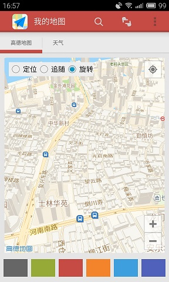
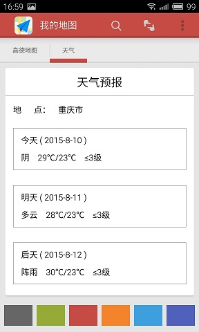

# MapDemo
***

- 加入了引导页,采用的[小红书欢迎引导第二版](https://github.com/w446108264/XhsWelcomeAnim)
- 基于leancloud的登录注册功能
- 高德地图，集成高德地图和定位sdk可三种模式切换
- 简化的二维扫描功能
- 使用了个推加入了推送功能
- 能查看当地近三天的天气情况

>TODO
>
>- 高德地图其他功能